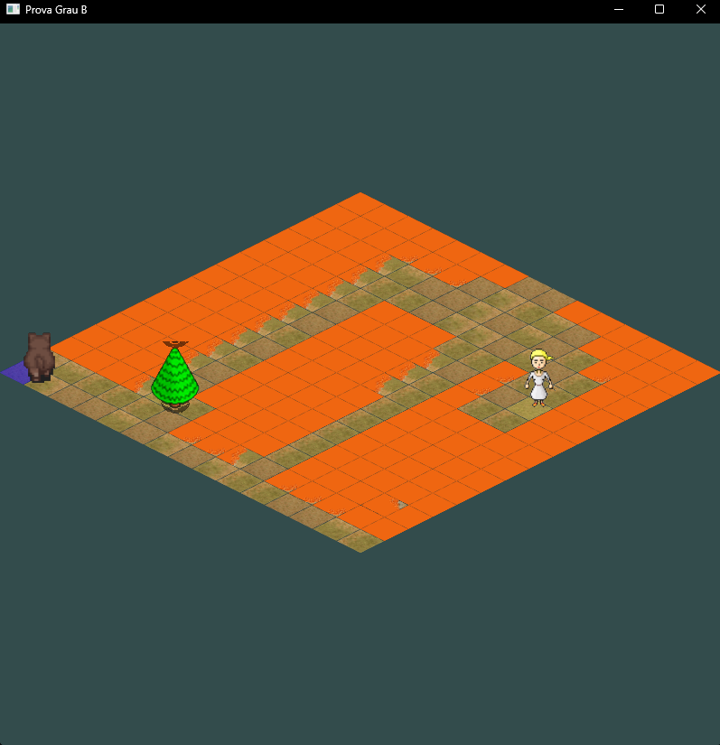

# ProcessamentoGrafico-Jogo-Grau-B
Repositório contendo o jogo para atividade final do Grau B da disciplina de Processamento Gráfico.

# Descrição do Jogo e Apresentação:
O jogo consiste na implementação de um tilemap isométrico simples, carregando diferentes texturas em cada tile, em conjunto com um mecanismo de movimentação personagem com animação de sprites.

No contexto do jogo desenvolvido, o objetivo é levar Spok, um cãozinho, até sua dona. Porém, você terá que guiar Spok para que ele não caia na lava e nem fique trancado por obstáculos.

Link para a apresentação da atividade: [Apresentação (NECESSÁRIO CONTA UNISINOS)](https://asavbrm-my.sharepoint.com/:v:/g/personal/lscheffel_edu_unisinos_br/ERiFdyEMLGhPmWg37QOmNhsBefF6U78b_XGY1eqJ653kyg?e=6zpGfg&nav=eyJyZWZlcnJhbEluZm8iOnsicmVmZXJyYWxBcHAiOiJTdHJlYW1XZWJBcHAiLCJyZWZlcnJhbFZpZXciOiJTaGFyZURpYWxvZy1MaW5rIiwicmVmZXJyYWxBcHBQbGF0Zm9ybSI6IldlYiIsInJlZmVycmFsTW9kZSI6InZpZXcifX0%3D)

OBS: Na gravação, o Software acabou distorcendo a cor da imagem, principalmente da textura do jogo (Provavelmente por causa da utilização de HDR), a cor real da textura é conforme o apresentado no screenshot acima!!!

# Instruções Para Executar:

O jogo foi desenvolvido em plataforma Windows, utilizando o VSCode como IDE em conjunto com as extensões C/C++ e IntelliSense, executando através do prompt do Visual Studio Build x64

1. Seguir essa documentação para setup do ambiente: https://code.visualstudio.com/docs/cpp/config-msvc
2. Executar o prompt x64 do Visual Studio Build
3. Mude o diretório atual no prompt para o diretório root do repositório
4. Inicialize a IDE do VSCode: code .
5. Na IDE, abra o arquivo main.cpp e execute-o com a extensão C/C++ da Microsoft para o VSCode.

Atenção: Passos Extras que podem ser necessários de acordo com seu ambiente:

-> No arquivo .vscode > c_cpp_properties.json, verifique se o argumento "compilerPath" está correto e existe em seu ambiente.